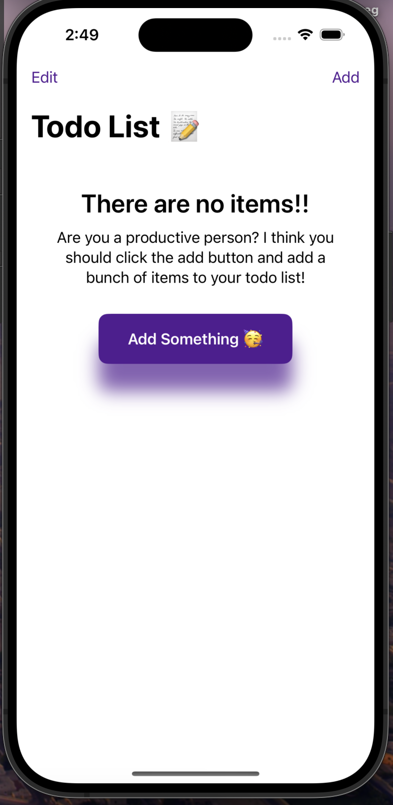
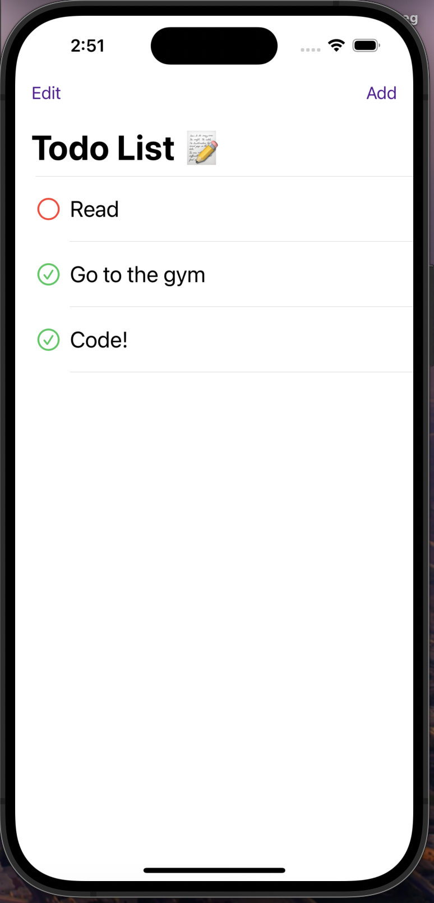
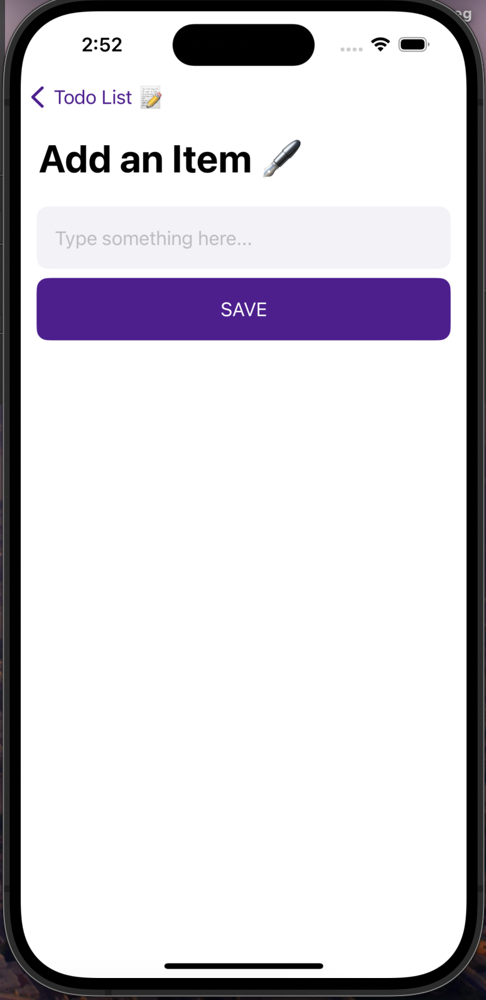

# 📝 Lista de Tareas - SwiftUI

¡Bienvenido a la aplicación de Lista de Tareas! Esta aplicación está 
construida utilizando SwiftUI con la arquitectura MVVM (Model-View-ViewModel). 
Permite agregar, editar y eliminar tareas con una interfaz moderna y amigable. 
Además, incluye persistencia de datos para mantener las tareas entre sesiones.

## Características

- **Agregar Tareas:** Crea nuevas tareas rápidamente con un botón de acción flotante.
- **Editar Tareas:** Modifica las tareas existentes para mantener la información actualizada.
- **Eliminar Tareas:** Elimina tareas completadas o innecesarias.
- **Persistencia de Datos:** Las tareas se guardan en el dispositivo y permanecen entre sesiones, utilizando `UserDefaults` o `Core Data`.
- **Interfaz Moderna:** Una interfaz limpia y amigable, diseñada con SwiftUI.

## Instalación

1. **Clonar el Repositorio**

   Clona este repositorio en tu máquina local usando el siguiente comando:

   ```bash
   git clone https://github.com/Chechobuitrago/SwiftUITodoList.git

2. **Abrir en Xcode**
   Abre el proyecto en Xcode:
   
   ```bash
   cd SwiftUITodoList
   open SwiftUITodoList.xcodeproj

3. **Ejecutar la Aplicación**
   Selecciona el simulador o dispositivo real desde Xcode y presiona el botón de “Play” para ejecutar la aplicación.


## Uso

- Agregar una Tarea: Toca el botón de + en la esquina superior derecha para agregar una      nueva tarea.
- Editar una Tarea: Toca una tarea en la lista para abrir el modo de edición. 
  Realiza los cambios necesarios y toca “Guardar”.
- Eliminar una Tarea: Desliza hacia la izquierda sobre una tarea en la lista para revelar    el botón de “Eliminar”.

| Google SignIn         | Create account          | Home Screen             |
| :-------------------- | :---------------------- | :---------------------- |
|  |  |  | 


## Contribuciones

¡Las contribuciones son bienvenidas! Si deseas mejorar la aplicación, por favor sigue estos pasos:

1. Haz un fork de este repositorio.
2. Crea una nueva rama (git checkout -b feature/nueva-caracteristica).
3. Realiza los cambios necesarios y haz commit (git commit -m 'Agrega nueva característica').
4. Sube los cambios a tu repositorio (git push origin feature/nueva-caracteristica).
5. Abre un Pull Request en este repositorio.

## Contacto

Si tienes alguna pregunta o comentario, no dudes en contactarme por Linkedin https://www.linkedin.com/in/sbuitragoa/

¡Gracias por usar la aplicación Lista de Tareas! 🚀
